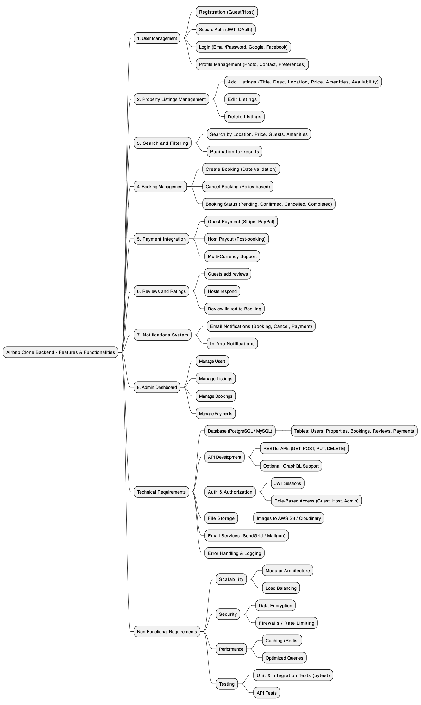

# Airbnb Clone Backend - Features and Functionalities

This document outlines the core features, technical requirements, and non-functional requirements that define the backend system of the Airbnb Clone project.

---

## 🎯 Objective

To build a scalable, secure, and efficient backend system for an Airbnb-like rental marketplace supporting guests, hosts, and admins.

---

## 🔑 Core Functionalities

### 1. User Management

- **User Registration**:
  - Sign up as guest or host
  - Secure authentication using JWT
- **Login & Authentication**:
  - Email/password login
  - OAuth support (Google, Facebook)
- **Profile Management**:
  - Update profile photo, contact info, preferences

### 2. Property Listings Management

- **Add Listings**:
  - Title, description, location, price, amenities, availability
- **Edit/Delete Listings**

### 3. Search and Filtering

- Search properties by:
  - Location, price range, number of guests, amenities
- Pagination for large result sets

### 4. Booking Management

- **Create Bookings**:
  - Prevent double bookings
- **Cancel Bookings**
- **Track Booking Status**:
  - Pending, confirmed, canceled, completed

### 5. Payment Integration

- **Secure Payment Gateways** (Stripe, PayPal)
- **Guest Payments** and **Host Payouts**
- Multi-currency support

### 6. Reviews and Ratings

- Guests rate properties
- Hosts respond to reviews
- Reviews linked to bookings

### 7. Notifications System

- Email and in-app notifications:
  - Booking confirmations, cancellations, payment updates

### 8. Admin Dashboard

- Manage users, properties, bookings, payments

---

## 🛠️ Technical Requirements

### 1. Database Management

- **PostgreSQL or MySQL**
- Tables:
  - Users, Properties, Bookings, Reviews, Payments

### 2. API Development

- **RESTful APIs** (GET, POST, PUT, DELETE)
- **Optional**: GraphQL for advanced queries

### 3. Authentication and Authorization

- **JWT-based sessions**
- **Role-based Access Control (RBAC)** for Guests, Hosts, Admins

### 4. File Storage

- Cloud file storage for images (AWS S3, Cloudinary)

### 5. Third-Party Services

- Email notifications (SendGrid, Mailgun)

### 6. Error Handling & Logging

- Global API error handling
- Logging for debugging

---

## 🚀 Non-Functional Requirements

### 1. Scalability

- Modular architecture
- Horizontal scaling with load balancers

### 2. Security

- Encrypted passwords and sensitive data
- Rate limiting and firewall protections

### 3. Performance Optimization

- Caching (Redis) for frequent data
- Optimized SQL queries

### 4. Testing

- Unit & integration tests (e.g., pytest)
- Automated API endpoint testing

---

## 🖼️ Visual Representation

> 

This image represents the system modules and their interactions for a clearer understanding of the backend architecture.

---

## 📁 Repository Info

- **Repository**: `alx-airbnb-project-documentation`
- **Directory**: `features-and-functionalities/`
- **File**: `README.md`
- **Diagram**: `Airbnb-features-and-functionalities.drawio.png`

---
