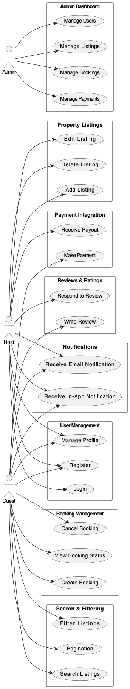

# Airbnb Clone Backend - Use Case Diagram

This directory contains the **Use Case Diagram** for the backend system of the Airbnb Clone project.

## 📌 Objective

The purpose of this diagram is to visualize how various actors (users) interact with the system and access its core functionalities. It provides a clear overview of the system's behavior from the end user's perspective.

## 👥 Actors

- **Guest**: A user who registers to book properties.
- **Host**: A user who registers to list and manage properties.
- **Admin**: A system administrator who oversees and manages the entire platform.

## ✅ Key Use Cases

### 1. **User Management**

- Registration (Guest/Host)
- Login
- Profile Management

### 2. **Property Listings Management**

- Add, Edit, and Delete Listings (Host only)

### 3. **Search and Filtering**

- Search properties by location, price, amenities, etc.
- Apply filters and pagination

### 4. **Booking Management**

- Create, Cancel Booking
- View Booking Status

### 5. **Payment Integration**

- Guest Payment (e.g., Stripe, PayPal)
- Host Payout (after booking)

### 6. **Reviews and Ratings**

- Guest can write reviews
- Host can respond to reviews

### 7. **Notifications System**

- Email and In-App notifications for bookings, cancellations, payments

### 8. **Admin Dashboard**

- Manage users, listings, bookings, and payments

## 📷 Diagram Preview

The following use case diagram illustrates the interactions between the actors and the system:

> 📂 **File location**: `use-case-diagram/airbnb-use-case-diagram.png`

## 🛠 Tools Used

- **Draw.io**: For general design
- **PlantUML**: For diagram scripting and export

---

This documentation serves as a reference for developers, designers, and stakeholders to understand the flow of features and responsibilities within the Airbnb Clone backend system.
